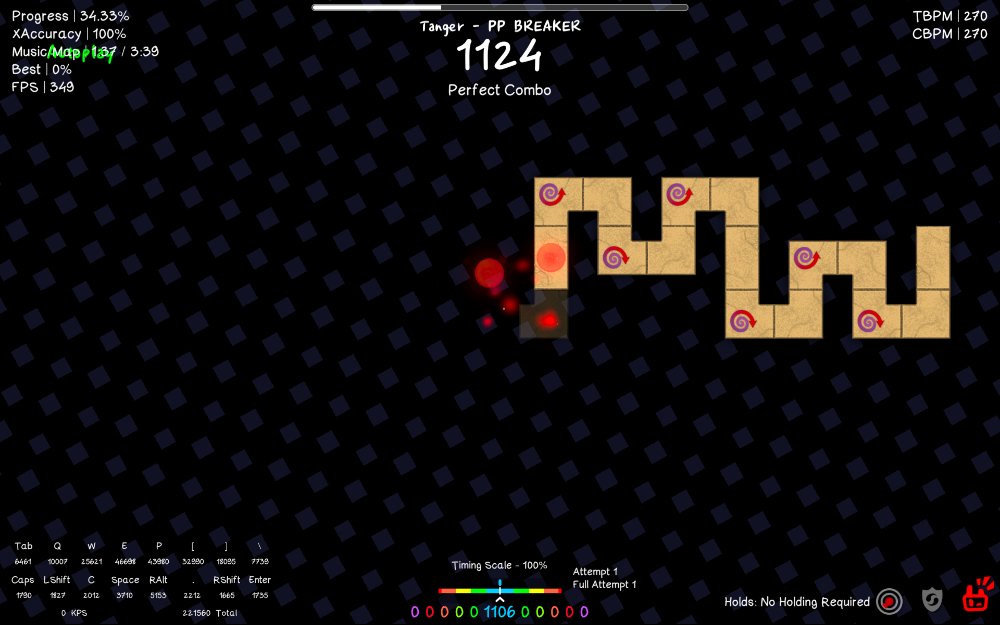

  <a href="README.md">🇺🇸 English</a> |
  <a>🇰🇷 한국어</a> | 
  <a href="CREDITS.md">⭐️ Credits</a>

# koren resource pack

[지퍼 리소스팩](https://github.com/Jongye0l/JipperResourcePack)에서 영감을 받아 제작한 모드입니다. 지퍼 리소스팩을 사용하는 사람들이 랙 관련 문제를 제의한 적이 있어 저만의 리소스팩을 개발해봤습니다.

피드백은 언제나 환영입니다!

지퍼리팩보다 좋은 이유:
- 커스텀 폰트 설정 가능
- 기능 추가 (예: 홀드 설정 표시)
- [DM Note](https://github.com/DmNote-App/DmNote) JSON 파일을 불러와서 바로 키뷰어 적용
- JALib 의존성 없음 (성능 향상 🚀)
- [XPerfect](https://github.com/8100print/XPerfect) 모드 지원

[디스코드 서버](https://discord.gg/mAzAghu5Xq)

아래는 1.1.0.1버전 스크린샷입니다.

