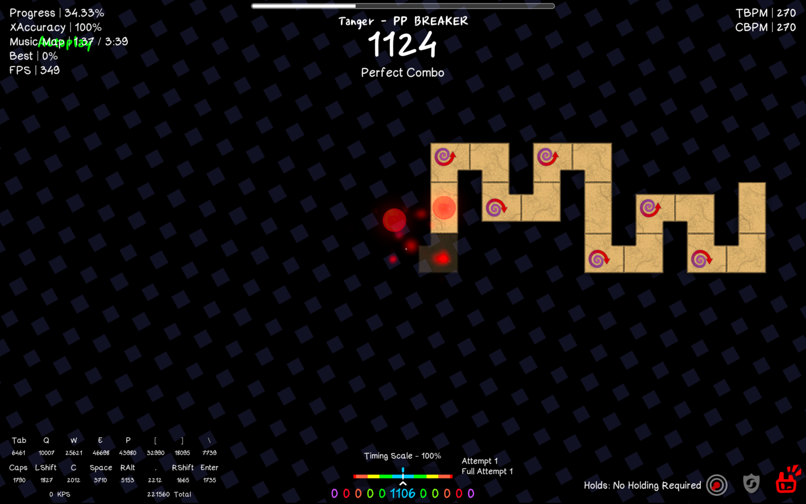

  <a href="README.md">🇺🇸 English</a> |
  <a>🇰🇷 한국어</a> | 
  <a href="CREDITS.kr.md">⭐️ 감사의 말</a>

# koren resource pack

[지퍼 리소스팩](https://github.com/Jongye0l/JipperResourcePack)에서 영감을 받아 제작한 모드입니다. 지퍼 리소스팩을 사용하는 사람들이 랙 관련 문제를 제의한 적이 있어 저만의 리소스팩을 개발해봤습니다.

피드백은 언제나 환영입니다!

지퍼리팩보다 좋은 이유:
- 커스텀 폰트 설정 가능
- 기능 추가 (예: 홀드 설정 표시)
- [DM Note](https://github.com/DmNote-App/DmNote) JSON 파일을 불러와서 바로 키뷰어 적용
- JALib 의존성 없음 (성능 향상 🚀)
- [XPerfect](https://github.com/8100print/XPerfect) 모드 지원
- 모드 안에 [KeyboardChatterBlocker](https://github.com/fangshenghan/KeyboardChatterBlocker) 있음
- Fmod (오디오 딜레이 감소 🎶)

[디스코드 서버](https://discord.gg/mAzAghu5Xq)

리눅스에서 1.1.1.2를 쓰는 경우: 게임 안 updater가 `backup_*` 폴더를 끝없이 만들면서 "Path is too long" 오류가 날 수 있습니다. 게임을 끄고 `Mods/KorenResourcePack` 폴더를 삭제한 뒤 최신 zip을 한 번 수동 설치하세요. 새 버전은 예전 백업 폴더를 정리하고 Unity Mod Manager의 "Install & Restart" 경로를 쓰지 않습니다.

아래는 1.1.0.1버전 스크린샷입니다.

